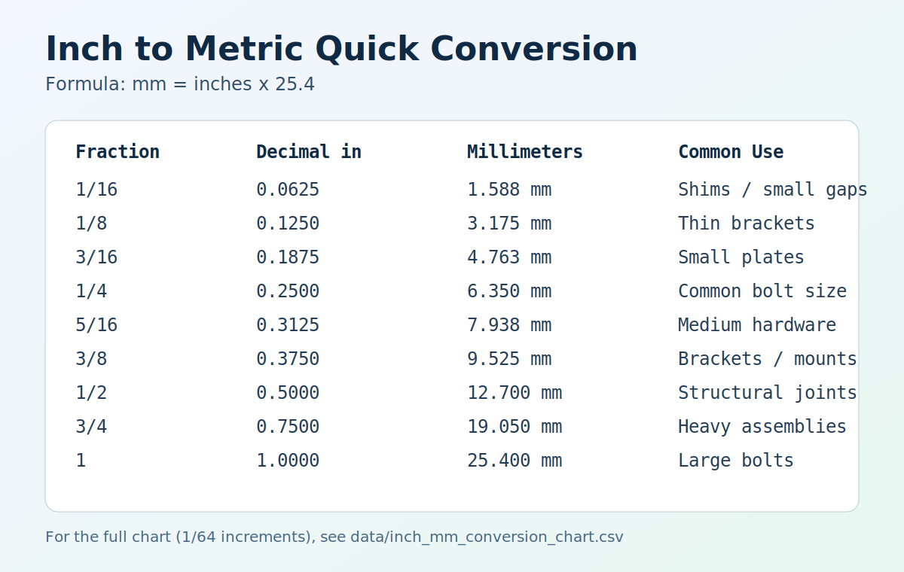
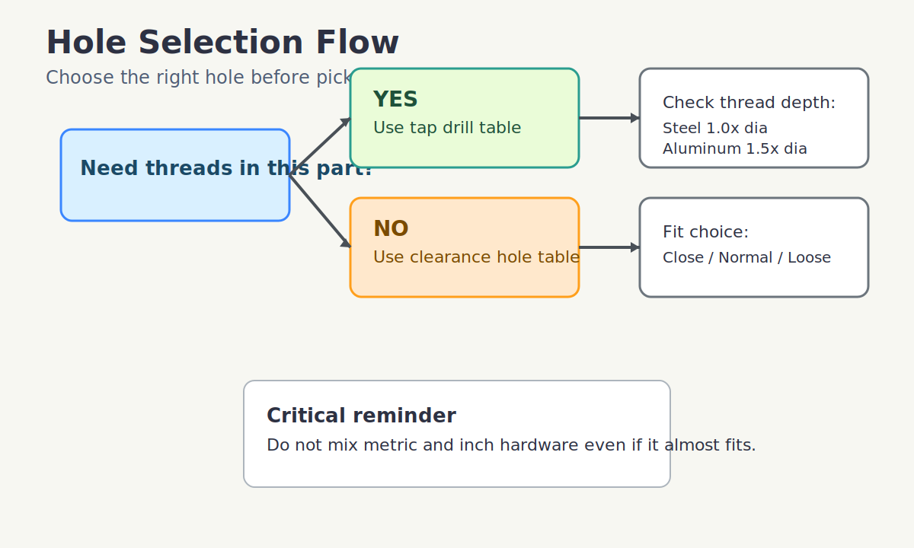

# Screw Selection and Hole Sizing Guide (Fusion 360 + Shop Use)

This repo is a practical reference for choosing screw sizes, picking the right hole diameter, and converting between metric and inch standards.

Use it when you need to answer:

- What drill size should I use for this screw?
- Should this be a clearance hole, tapped hole, or pilot hole?
- What is the closest metric/inch equivalent?
- How deep should threads be for this material?

## Start Here: 30-Second Decision Flow

1. Identify the screw thread standard and size (`M6x1.0`, `1/4-20`, etc.).
2. Decide hole function:
   - `Clearance hole`: screw passes through this part.
   - `Tapped hole`: threads are cut in this part.
   - `Pilot hole`: wood/sheet-metal screw forms its own threads.
3. Pull the value from the matching table:
   - Clearance: `data/clearance_hole_sizes.csv`
   - Tapped hole drill: `data/common_tap_drills.csv`
   - Metric/inch comparison: `data/unified_coarse_to_metric.csv`, `data/metric_coarse_to_unified.csv`
4. Confirm material and thickness:
   - Thread engagement guidance: `data/material_thread_engagement.csv`
   - Typical screw length ranges: `data/common_length_ranges.csv`

## Core Rules (Beginner Safe)

- Do not mix metric and inch threads even if they "almost fit".
- For tapped holes, minimum thread engagement:
  - Steel: `1.0 x screw diameter`
  - Aluminum/brass: `1.5 x screw diameter`
  - Plastics: `2.0 x screw diameter` or use inserts
- If material is thinner than about `1.0 x diameter`, avoid direct tapping and use a nut/insert/rivnut.
- Keep hole centers away from edges:
  - Metal: at least `1.5 x diameter`
  - Plastic/wood: at least `2.0 x diameter`

## Quick Reference Tables

### Common Tap Drill Sizes

| Thread | Tap Drill |
|---|---:|
| M3 x 0.5 | 2.5 mm |
| M4 x 0.7 | 3.3 mm |
| M5 x 0.8 | 4.2 mm |
| M6 x 1.0 | 5.0 mm |
| M8 x 1.25 | 6.8 mm |
| #6-32 | #36 (2.71 mm) |
| #8-32 | #29 (3.45 mm) |
| #10-24 | #25 (3.80 mm) |
| 1/4-20 | #7 (5.11 mm) |

### Common Clearance Holes (Pass-Through)

| Thread | Close (mm) | Normal (mm) | Loose (mm) |
|---|---:|---:|---:|
| M4 | 4.3 | 4.5 | 4.8 |
| M5 | 5.3 | 5.5 | 5.8 |
| M6 | 6.4 | 6.6 | 7.0 |
| M8 | 8.4 | 9.0 | 10.0 |
| #8 | 4.3 | 4.5 | 4.8 |
| #10 | 4.9 | 5.2 | 5.5 |
| 1/4-20 | 6.6 | 6.8 | 7.1 |

## Fusion 360 Notes

- Use User Parameters for hole/tap sizes (`M6_Clearance_Normal`, `M6_TapDrill`, etc.).
- Keep one parameter set per hardware system (metric vs inch).
- Use named sketches/features so updates from table changes are easy.
- For printed prototypes, model nominal holes and tune with printer-specific compensation after test prints.

## 3D Printed Parts Notes (PLA/PETG)

- Prefer heat-set inserts for repeated assembly.
- Direct printed threads in PLA are acceptable for low-cycle, low-load use.
- Around screw bosses: use at least 4 perimeters and moderate/high infill.
- Add fillets at boss base and chamfers at hole entry to reduce cracking.

## Repository Layout

- `SCREW_GUIDE.md`: one-page quick field guide
- `data/unified_coarse_to_metric.csv`
- `data/metric_coarse_to_unified.csv`
- `data/common_tap_drills.csv`
- `data/clearance_hole_sizes.csv`
- `data/material_thread_engagement.csv`
- `data/common_length_ranges.csv`
- `data/inch_unified_sizes.csv` (expanded inch sizes with UNC/UNF/UNEF columns)
- `data/metric_iso_sizes.csv` (expanded metric sizes with coarse/fine pitches)
- `data/inch_mm_conversion_chart.csv` (fractional inch to mm, 1/64 increments)
- `data/through_hole_to_inch_screw_quick_chart.csv` (caliper-measured hole -> likely inch screw)
- `docs/full-size-reference.md`
- `docs/through-hole-caliper-quick-chart.md`
- `images/inch-metric-conversion.svg`
- `images/hole-selection-flow.svg`

## Visual References

### Inch-Metric Conversion

### Hole Selection Flow

## Scope

These tables are intended for design and shop decision support. For critical or safety-sensitive assemblies, verify against current standards and supplier data.
