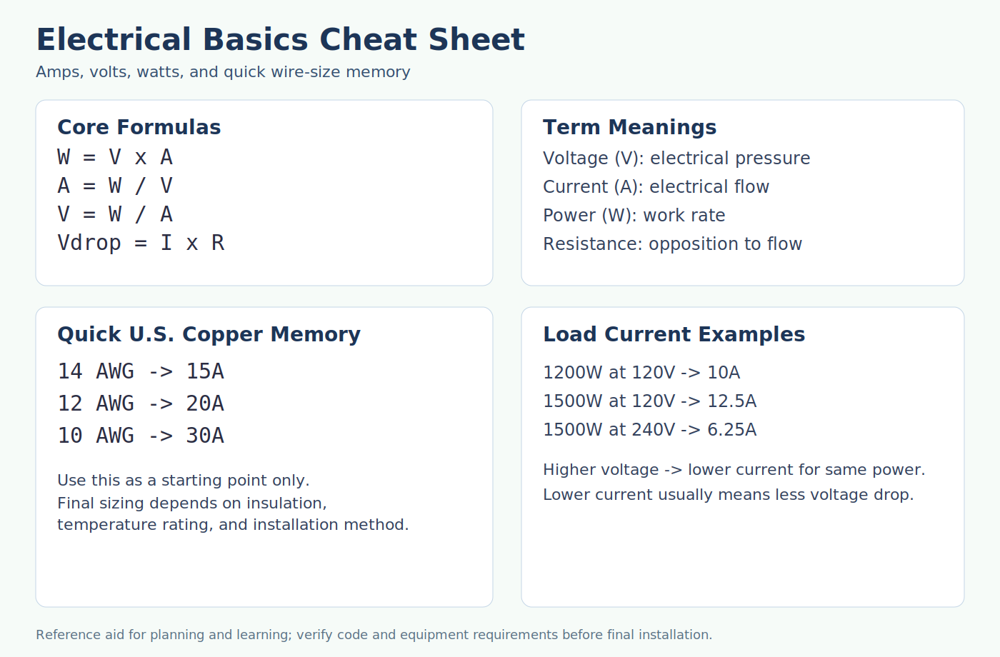

# Shop Reference: Mechanical + Electrical (All-In-One)

This README is the full in-one-place reference for your work:

- Section 1: Screw sizes, measuring, hole selection, Fusion/3D mount workflows
- Section 2: Wire gauge, ampacity, volts/amps/watts, and electrical quick math

---

## Section 1: Screws, 3D Modeling, Measuring, Mounts

### Visuals

### 1) Fast Decision Flow

1. Identify thread: metric (`M5x0.8`) or inch (`1/4-20`, `#10-24`).
2. Choose hole type:
   - `Clearance hole` (bolt passes through)
   - `Tapped hole` (threads in part)
   - `Pilot hole` (self-threading screw)
3. Apply the matching table below.
4. For printed mounts, confirm nut trap + washer + bolt length stack-up.

### 2) Core Mechanical Rules

- Do not mix metric and inch threads.
- Minimum tapped engagement (starter rule):
  - Steel: `1.0 x diameter`
  - Aluminum/brass: `1.5 x diameter`
  - Plastics: `2.0 x diameter`
- Edge distance from hole center:
  - Metal: `>= 1.5 x diameter`
  - Plastic/wood: `>= 2.0 x diameter`

### 3) UNC to Closest Metric

| UNC size | Major dia (in) | Major dia (mm) | TPI | Pitch (mm) | Closest metric (approx) |
|---|---:|---:|---:|---:|---|
| #0-80 | 0.0600 | 1.524 | 80 | 0.318 | M1.6 x 0.35 |
| #1-64 | 0.0730 | 1.854 | 64 | 0.397 | M2.0 x 0.40 |
| #2-56 | 0.0860 | 2.184 | 56 | 0.454 | M2.2 x 0.45 |
| #3-48 | 0.0990 | 2.515 | 48 | 0.529 | M2.5 x 0.45 |
| #4-40 | 0.1120 | 2.845 | 40 | 0.635 | M3.0 x 0.50 |
| #5-40 | 0.1250 | 3.175 | 40 | 0.635 | M3.5 x 0.60 |
| #6-32 | 0.1380 | 3.505 | 32 | 0.794 | M4.0 x 0.70 |
| #8-32 | 0.1640 | 4.166 | 32 | 0.794 | M4.5 x 0.75 |
| #10-24 | 0.1900 | 4.826 | 24 | 1.058 | M5.0 x 0.80 |
| #12-24 | 0.2160 | 5.486 | 24 | 1.058 | M5.5 x 0.90 |
| 1/4-20 | 0.2500 | 6.350 | 20 | 1.270 | M6.0 x 1.00 |
| 5/16-18 | 0.3125 | 7.938 | 18 | 1.411 | M8.0 x 1.25 |
| 3/8-16 | 0.3750 | 9.525 | 16 | 1.588 | M10 x 1.50 |
| 7/16-14 | 0.4375 | 11.113 | 14 | 1.814 | M12 x 1.75 |
| 1/2-13 | 0.5000 | 12.700 | 13 | 1.954 | M12 x 1.75 |
| 9/16-12 | 0.5625 | 14.288 | 12 | 2.117 | M14 x 2.00 |
| 5/8-11 | 0.6250 | 15.875 | 11 | 2.309 | M16 x 2.00 |
| 3/4-10 | 0.7500 | 19.050 | 10 | 2.540 | M20 x 2.50 |
| 7/8-9 | 0.8750 | 22.225 | 9 | 2.822 | M22 x 2.50 |
| 1-8 | 1.0000 | 25.400 | 8 | 3.175 | M24 x 3.00 |

### 4) Metric Coarse to Closest Inch

| Metric size | Major dia (mm) | Pitch (mm) | TPI eq. | Closest inch/UNC (approx) |
|---|---:|---:|---:|---|
| M2 x 0.40 | 2.000 | 0.40 | 63.5 | #1-64 |
| M2.5 x 0.45 | 2.500 | 0.45 | 56.4 | #2-56 |
| M3 x 0.50 | 3.000 | 0.50 | 50.8 | #4-40 or #3-48 |
| M4 x 0.70 | 4.000 | 0.70 | 36.3 | #6-32 |
| M5 x 0.80 | 5.000 | 0.80 | 31.8 | #10-32 or #8-32 |
| M6 x 1.00 | 6.000 | 1.00 | 25.4 | 1/4-20 |
| M8 x 1.25 | 8.000 | 1.25 | 20.3 | 5/16-18 |
| M10 x 1.50 | 10.000 | 1.50 | 16.9 | 3/8-16 |
| M12 x 1.75 | 12.000 | 1.75 | 14.5 | 1/2-13 |
| M14 x 2.00 | 14.000 | 2.00 | 12.7 | 9/16-12 |
| M16 x 2.00 | 16.000 | 2.00 | 12.7 | 5/8-11 |
| M20 x 2.50 | 20.000 | 2.50 | 10.2 | 3/4-10 |

### 5) Tap Drill Quick Table

| Thread | Tap Drill | Notes |
|---|---|---|
| #4-40 | #43 (2.26 mm) | ~75% thread typical |
| #6-32 | #36 (2.71 mm) | ~75% thread typical |
| #8-32 | #29 (3.45 mm) | ~75% thread typical |
| #10-24 | #25 (3.80 mm) | ~75% thread typical |
| #10-32 | #21 (4.04 mm) | ~75% thread typical |
| 1/4-20 | #7 (5.11 mm) | ~75% thread typical |
| 5/16-18 | F (6.53 mm) | ~75% thread typical |
| 3/8-16 | 5/16 (7.94 mm) | ~75% thread typical |
| 1/2-13 | 27/64 (10.72 mm) | ~75% thread typical |
| M3 x 0.5 | 2.5 mm | major - pitch rule |
| M4 x 0.7 | 3.3 mm | major - pitch rule |
| M5 x 0.8 | 4.2 mm | major - pitch rule |
| M6 x 1.0 | 5.0 mm | major - pitch rule |
| M8 x 1.25 | 6.8 mm | major - pitch rule |
| M10 x 1.5 | 8.5 mm | major - pitch rule |
| M12 x 1.75 | 10.2 mm | major - pitch rule |

### 6) Clearance Hole Sizes

| Thread size | Close fit (mm) | Normal fit (mm) | Loose fit (mm) |
|---|---:|---:|---:|
| #4 | 2.9 | 3.1 | 3.3 |
| #6 | 3.6 | 3.8 | 4.0 |
| #8 | 4.3 | 4.5 | 4.8 |
| #10 | 4.9 | 5.2 | 5.5 |
| 1/4-20 | 6.6 | 6.8 | 7.1 |
| 5/16-18 | 8.2 | 8.5 | 9.0 |
| 3/8-16 | 9.8 | 10.2 | 10.7 |
| M3 | 3.2 | 3.4 | 3.6 |
| M4 | 4.3 | 4.5 | 4.8 |
| M5 | 5.3 | 5.5 | 5.8 |
| M6 | 6.4 | 6.6 | 7.0 |
| M8 | 8.4 | 9.0 | 10.0 |
| M10 | 10.5 | 11.0 | 12.0 |

### 7) Caliper Through-Hole to Screw Size (Inch)

| Measured hole (in) | Measured hole (mm) | Likely inch screw |
|---|---|---|
| 0.084 to 0.103 | 2.13 to 2.62 | #2 |
| 0.103 to 0.125 | 2.62 to 3.18 | #4 |
| 0.125 to 0.152 | 3.18 to 3.86 | #6 |
| 0.152 to 0.178 | 3.86 to 4.52 | #8 |
| 0.178 to 0.206 | 4.52 to 5.23 | #10 |
| 0.206 to 0.237 | 5.23 to 6.02 | #12 |
| 0.237 to 0.282 | 6.02 to 7.16 | 1/4 |
| 0.282 to 0.345 | 7.16 to 8.76 | 5/16 |
| 0.345 to 0.410 | 8.76 to 10.41 | 3/8 |
| 0.410 to 0.473 | 10.41 to 12.01 | 7/16 |
| 0.473 to 0.540 | 12.01 to 13.72 | 1/2 |

### 8) Caliper Through-Hole to Screw Size (Metric)

| Measured hole (mm) | Measured hole (in) | Likely metric screw |
|---|---|---|
| 1.8 to 2.3 | 0.071 to 0.091 | M2 |
| 2.3 to 2.8 | 0.091 to 0.110 | M2.5 |
| 2.8 to 3.4 | 0.110 to 0.134 | M3 |
| 3.4 to 4.3 | 0.134 to 0.169 | M4 |
| 4.3 to 5.3 | 0.169 to 0.209 | M5 |
| 5.3 to 6.4 | 0.209 to 0.252 | M6 |
| 6.4 to 8.4 | 0.252 to 0.331 | M8 |
| 8.4 to 10.5 | 0.331 to 0.413 | M10 |
| 10.5 to 12.5 | 0.413 to 0.492 | M12 |
| 12.5 to 14.5 | 0.492 to 0.571 | M14 |
| 14.5 to 16.5 | 0.571 to 0.650 | M16 |

### 9) Nut Traps and Washers (Mount Design)

| Thread | Nut AF (mm) | Nut Thickness (mm) | Pocket AF (mm) | Pocket Depth (mm) |
|---|---:|---:|---:|---:|
| M3 | 5.5 | 2.4 | 5.8 | 2.6 |
| M4 | 7.0 | 3.2 | 7.3 | 3.5 |
| M5 | 8.0 | 4.0 | 8.3 | 4.3 |
| M6 | 10.0 | 5.0 | 10.3 | 5.4 |
| #8-32 | 8.73 | 3.18 | 9.0 | 3.4 |
| #10-24/32 | 9.53 | 3.96 | 9.8 | 4.3 |
| 1/4-20 | 11.11 | 5.56 | 11.5 | 6.0 |

| Thread | Typical Washer ID (mm) | Typical Washer OD (mm) | Thickness (mm) |
|---|---:|---:|---:|
| M3 | 3.2 | 7.0 | 0.5 |
| M4 | 4.3 | 9.0 | 0.8 |
| M5 | 5.3 | 10.0 | 1.0 |
| M6 | 6.4 | 12.0 | 1.6 |
| #8 | 4.5 | 11.1 | 1.0 |
| #10 | 5.5 | 12.7 | 1.0 |
| 1/4 | 6.9 | 18.0 | 1.6 |

### 10) Bolt Length Selector (Through-Bolt)

Formula:

`bolt length ~= clamped stack + washer stack + nut thickness + thread allowance`

Thread allowance:

- Standard nut: `1-2 threads`
- Nyloc: `2-3 threads`

### 11) Pipe and Clamp Quick Reference (No-Paint + Painted)

| NPS | Actual OD (in) | Actual OD (mm) | Typical Painted OD Range (mm) | Clamp Label |
|---|---:|---:|---|---|
| 1/2 | 0.840 | 21.34 | 21.5-22.0 | 1/2 in pipe clamp |
| 3/4 | 1.050 | 26.67 | 26.9-27.4 | 3/4 in pipe clamp |
| 1 | 1.315 | 33.40 | 33.6-34.1 | 1 in pipe clamp |
| 1-1/2 | 1.900 | 48.26 | 48.5-49.1 | 1-1/2 in pipe clamp |
| 2 | 2.375 | 60.33 | 60.6-61.2 | 2 in pipe clamp |

Notes:

- NPS is nominal; OD is what you model around.
- Measure bare/no-paint OD when possible.

### 12) Fusion 360 Parameter Starters (Nut + Bolt Workflow)

Core parameters:

- `Fastener_Dia`, `Clearance_Normal`, `Washer_OD`, `Washer_Thickness`
- `Nut_AF`, `Nut_Thickness`, `NutTrap_AF`, `NutTrap_Depth`
- `Boss_OD`, `Edge_Min`

Starter expressions:

- `Boss_OD = Fastener_Dia * 2.0`
- `Edge_Min = Fastener_Dia * 2.0`
- `NutTrap_AF = Nut_AF + 0.30 mm`
- `NutTrap_Depth = Nut_Thickness + 0.30 mm`

### 13) Specialty Tool Purposes (Panel/PCB/Plastics)

| Tool | Purpose | Use It For |
|---|---|---|
| Step drill bit | Clean enlarging in sheet/plastic | Switches, glands, panel holes |
| Knockout punch | Precision large round holes | Enclosure penetrations |
| Deburring tool | Remove sharp edges | Post-drill finish |
| Countersink bit | Edge chamfer/stress relief | Plastic hole crack prevention |
| Torque screwdriver | Repeatable torque | Terminals, PCB mounts |
| Ferrule crimper | Proper stranded wire terminations | Control panel wiring |
| Pitch gauge + calipers | Thread identification | Unknown screw matching |
| Grommet/cable gland kit | Strain relief/protection | Cable entries |

---

## Section 2: Wires, Cables, Energy Basics (Amps/Volts/Watts)

### Visual

### 1) Core Terms and Formulas

- Voltage (V): electrical pressure
- Current (A): electrical flow
- Power (W): work rate
- Resistance (ohms): opposition to flow

Core formulas:

- `W = V x A`
- `A = W / V`
- `V = W / A`
- `Vdrop = I x R`

Examples:

- `1200W @ 120V = 10A`
- `1200W @ 240V = 5A`
- Same power at higher voltage -> lower current.

### 2) Wire Gauge Memory Points

- `14 AWG -> 15A` typical branch-circuit pairing
- `12 AWG -> 20A` typical branch-circuit pairing
- `10 AWG -> 30A` typical branch-circuit pairing

30A quick answer:

- Usually `10 AWG copper` (or `8 AWG aluminum` in many cases), then verify final installation conditions.

### 3) U.S. Copper AWG Ampacity Quick Table

| AWG | 60C (A) | 75C (A) | 90C (A) | Typical Pairing Note |
|---|---:|---:|---:|---|
| 14 | 15 | 20 | 25 | Often paired with 15A breaker |
| 12 | 20 | 25 | 30 | Often paired with 20A breaker |
| 10 | 30 | 35 | 40 | Often paired with 30A breaker |
| 8 | 40 | 50 | 55 | Common 40-50A loads |
| 6 | 55 | 65 | 75 | Common 60A circuits |
| 4 | 70 | 85 | 95 | Larger feeders/equipment |
| 3 | 85 | 100 | 110 | Larger feeders/equipment |
| 2 | 95 | 115 | 130 | Larger feeders/equipment |
| 1 | 110 | 130 | 145 | Larger feeders/equipment |
| 1/0 | 125 | 150 | 170 | 125-150A feeders |
| 2/0 | 145 | 175 | 195 | 150-175A feeders |
| 3/0 | 165 | 200 | 225 | 200A class feeders |
| 4/0 | 195 | 230 | 260 | High-current feeders |

### 4) Common AWG Sizes Reference

| AWG | Dia (mm) | Dia (in) | Ohms/1000ft Cu @20C | Typical Use |
|---|---:|---:|---:|---|
| 24 | 0.511 | 0.0201 | 25.67 | Signal wiring |
| 22 | 0.644 | 0.0253 | 16.14 | Sensors/control signals |
| 20 | 0.812 | 0.0320 | 10.15 | Low-current control power |
| 18 | 1.024 | 0.0403 | 6.385 | Controls/light power |
| 16 | 1.291 | 0.0508 | 4.016 | Lighting/moderate loads |
| 14 | 1.628 | 0.0641 | 2.525 | 15A branches |
| 12 | 2.053 | 0.0808 | 1.588 | 20A branches |
| 10 | 2.588 | 0.1019 | 0.999 | 30A branches |
| 8 | 3.264 | 0.1285 | 0.6282 | Larger loads |
| 6 | 4.115 | 0.1620 | 0.3951 | Feeders |

### 5) Common Voltage Levels (U.S.)

| Voltage | Typical Use |
|---|---|
| 5V DC | Logic electronics / USB-powered devices |
| 12V DC | Automotive/accessory/control loads |
| 24V DC | Industrial controls/PLCs/sensors |
| 48V DC | Telecom/battery systems |
| 120V AC | General receptacles/small loads |
| 208V AC 3ph | Commercial 3-phase systems |
| 240V AC split-phase | Heaters/appliances/tools |
| 277V AC | Commercial lighting |
| 480V AC 3ph | Industrial motors/large equipment |

### 6) Power Formula Cheat Lines

| Scenario | Formula | Example |
|---|---|---|
| DC / single-phase resistive | `P = V x I` | `120V x 2A = 240W` |
| Find current | `I = P / V` | `1500W / 120V = 12.5A` |
| Find voltage | `V = P / I` | `240W / 2A = 120V` |
| Ohm's law | `V = I x R` | `2A x 5ohm = 10V` |
| Heating power | `P = I^2 x R` | `10A^2 x 0.1ohm = 10W` |
| Single-phase apparent power | `VA = V x I` | `120V x 5A = 600VA` |
| Three-phase real power | `P ~= 1.732 x V x I x PF` | `1.732 x 480 x 10 x 0.9 = 7.48kW` |

---

## Safety and Scope

This README is a practical planning and shop reference. Final mechanical and electrical decisions must be verified against:

- Actual hardware specs and manufacturer data
- Correct thread and fit standards
- Electrical code and equipment ratings
- Installation conditions (temperature, bundling, run length, environment)
