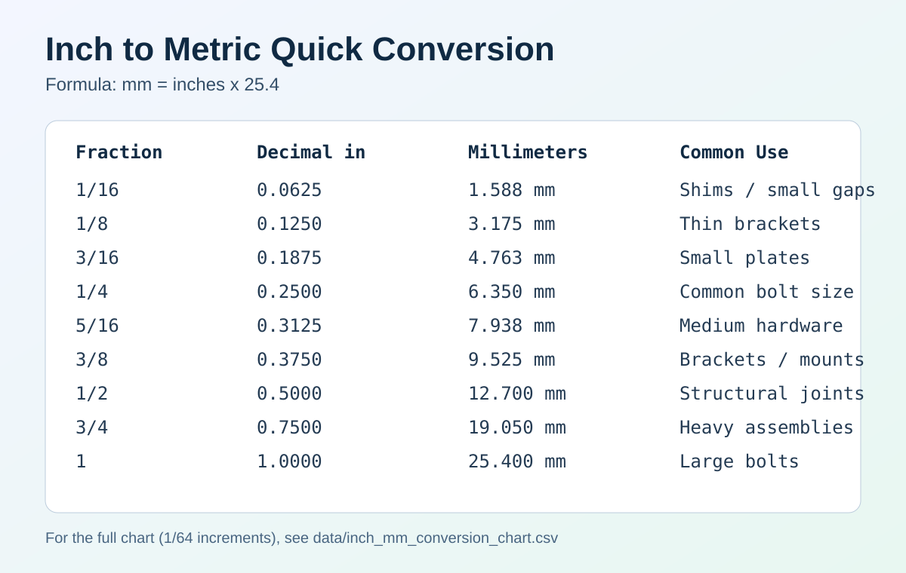
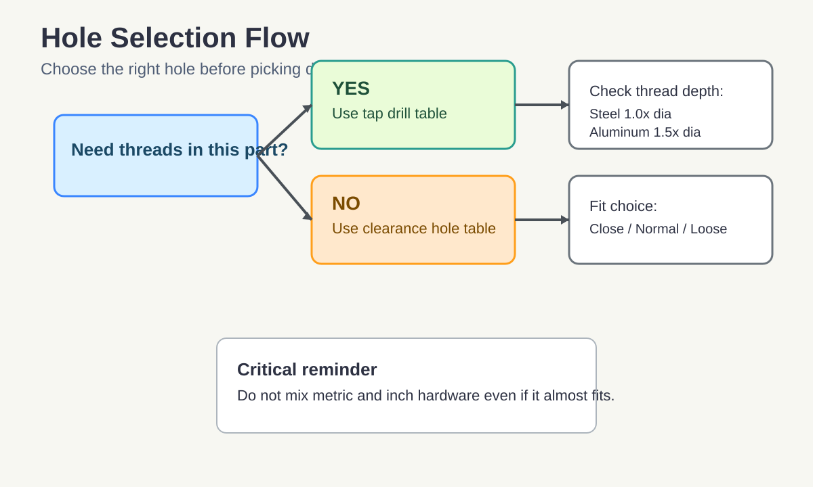
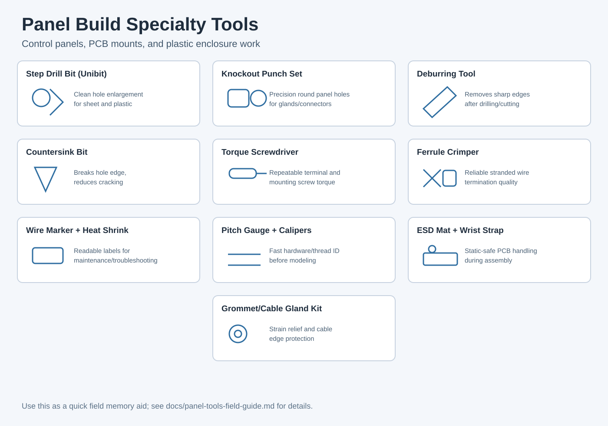
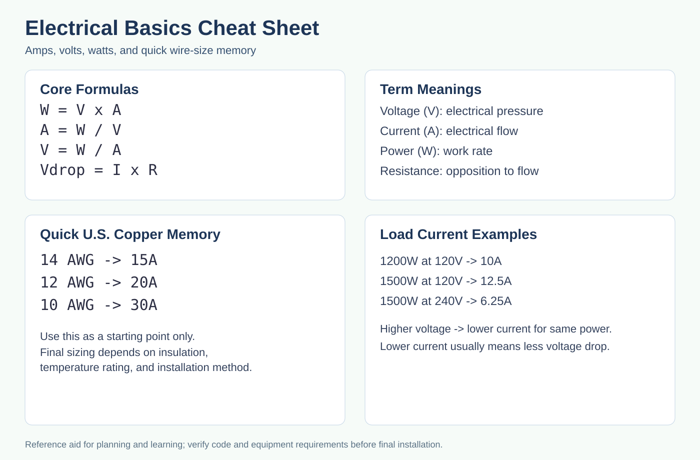

# Shop Reference: Mechanical + Electrical + Communications (All-In-One)

This README is the full in-one-place reference for your work:

- Section 1: Screw sizes, measuring, hole selection, Fusion/3D mount workflows
- Section 2: Wire gauge, ampacity, volts/amps/watts, and electrical quick math
- Section 3: Embedded communications (UART, SPI, I2C) and Modbus RTU over RS-485
- Section 4: Pneumatic valves (what they are, how they operate, when to use them)

## Quick Navigation

- [Section 1: Screws, 3D Modeling, Measuring, Mounts](#section-1)
- [CNC Quickstart (Buttons + XYZ Zero)](#cnc-quickstart)
- [Section 2: Wires, Cables, Energy Basics](#section-2)
- [PCB Components Primer](#pcb-components-primer)
- [Section 3: Embedded Communications](#section-3)
- [Section 4: Pneumatic Valves Basics](#section-4)
- [Pneumatic Valves Standalone Guide](docs/pneumatic-valves-basics.md)
- [Safety and Scope](#safety-and-scope)

---

## Section 1: Screws, 3D Modeling, Measuring, Mounts

### Visuals

### 1) Fast Decision Flow

1. Identify thread: metric (`M5x0.8`) or inch (`1/4-20`, `#10-24`).
2. Choose hole type:
   - `Clearance hole` (bolt passes through)
   - `Tapped hole` (threads in part)
   - `Pilot hole` (self-threading screw)
3. Apply the matching table below.
4. For printed mounts, confirm nut trap + washer + bolt length stack-up.

### 2) Core Mechanical Rules

- Do not mix metric and inch threads.
- Minimum tapped engagement (starter rule):
  - Steel: `1.0 x diameter`
  - Aluminum/brass: `1.5 x diameter`
  - Plastics: `2.0 x diameter`
- Edge distance from hole center:
  - Metal: `>= 1.5 x diameter`
  - Plastic/wood: `>= 2.0 x diameter`

### 3) UNC to Closest Metric

| UNC size | Size format | Major dia (in) | Major dia (mm) | TPI | Pitch (mm) | Closest metric (approx) |
|---|---|---:|---:|---:|---:|---|
| #0-80 | Numbered (`#0`) | 0.0600 | 1.524 | 80 | 0.318 | M1.6 x 0.35 |
| #1-64 | Numbered (`#1`) | 0.0730 | 1.854 | 64 | 0.397 | M2.0 x 0.40 |
| #2-56 | Numbered (`#2`) | 0.0860 | 2.184 | 56 | 0.454 | M2.2 x 0.45 |
| #3-48 | Numbered (`#3`) | 0.0990 | 2.515 | 48 | 0.529 | M2.5 x 0.45 |
| #4-40 | Numbered (`#4`) | 0.1120 | 2.845 | 40 | 0.635 | M3.0 x 0.50 |
| #5-40 | Numbered (`#5`) | 0.1250 | 3.175 | 40 | 0.635 | M3.5 x 0.60 |
| #6-32 | Numbered (`#6`) | 0.1380 | 3.505 | 32 | 0.794 | M4.0 x 0.70 |
| #8-32 | Numbered (`#8`) | 0.1640 | 4.166 | 32 | 0.794 | M4.5 x 0.75 |
| #10-24 | Numbered (`#10`) | 0.1900 | 4.826 | 24 | 1.058 | M5.0 x 0.80 |
| #12-24 | Numbered (`#12`) | 0.2160 | 5.486 | 24 | 1.058 | M5.5 x 0.90 |
| 1/4-20 | Fractional (`1/4`) | 0.2500 | 6.350 | 20 | 1.270 | M6.0 x 1.00 |
| 5/16-18 | Fractional (`5/16`) | 0.3125 | 7.938 | 18 | 1.411 | M8.0 x 1.25 |
| 3/8-16 | Fractional (`3/8`) | 0.3750 | 9.525 | 16 | 1.588 | M10 x 1.50 |
| 7/16-14 | Fractional (`7/16`) | 0.4375 | 11.113 | 14 | 1.814 | M12 x 1.75 |
| 1/2-13 | Fractional (`1/2`) | 0.5000 | 12.700 | 13 | 1.954 | M12 x 1.75 |
| 9/16-12 | Fractional (`9/16`) | 0.5625 | 14.288 | 12 | 2.117 | M14 x 2.00 |
| 5/8-11 | Fractional (`5/8`) | 0.6250 | 15.875 | 11 | 2.309 | M16 x 2.00 |
| 3/4-10 | Fractional (`3/4`) | 0.7500 | 19.050 | 10 | 2.540 | M20 x 2.50 |
| 7/8-9 | Fractional (`7/8`) | 0.8750 | 22.225 | 9 | 2.822 | M22 x 2.50 |
| 1-8 | Fractional (`1`) | 1.0000 | 25.400 | 8 | 3.175 | M24 x 3.00 |

Note: inch screw "number sizes" are `#0` through `#12`. Above that, inch sizes are typically fractional (`1/4`, `5/16`, `3/8`, etc.).

### 4) Metric Coarse to Closest Inch

| Metric size | Major dia (mm) | Pitch (mm) | TPI eq. | Closest inch/UNC (approx) |
|---|---:|---:|---:|---|
| M2 x 0.40 | 2.000 | 0.40 | 63.5 | #1-64 |
| M2.5 x 0.45 | 2.500 | 0.45 | 56.4 | #2-56 |
| M3 x 0.50 | 3.000 | 0.50 | 50.8 | #4-40 or #3-48 |
| M4 x 0.70 | 4.000 | 0.70 | 36.3 | #6-32 |
| M5 x 0.80 | 5.000 | 0.80 | 31.8 | #10-32 or #8-32 |
| M6 x 1.00 | 6.000 | 1.00 | 25.4 | 1/4-20 |
| M8 x 1.25 | 8.000 | 1.25 | 20.3 | 5/16-18 |
| M10 x 1.50 | 10.000 | 1.50 | 16.9 | 3/8-16 |
| M12 x 1.75 | 12.000 | 1.75 | 14.5 | 1/2-13 |
| M14 x 2.00 | 14.000 | 2.00 | 12.7 | 9/16-12 |
| M16 x 2.00 | 16.000 | 2.00 | 12.7 | 5/8-11 |
| M20 x 2.50 | 20.000 | 2.50 | 10.2 | 3/4-10 |

### 5) Fraction to Inch/mm Quick Chart (Top 20)

| Fraction | Decimal inch | mm |
|---|---:|---:|
| 1/64 | 0.015625 | 0.397 |
| 1/32 | 0.031250 | 0.794 |
| 1/16 | 0.062500 | 1.588 |
| 3/32 | 0.093750 | 2.381 |
| 1/8 | 0.125000 | 3.175 |
| 5/32 | 0.156250 | 3.969 |
| 3/16 | 0.187500 | 4.763 |
| 7/32 | 0.218750 | 5.556 |
| 1/4 | 0.250000 | 6.350 |
| 9/32 | 0.281250 | 7.144 |
| 5/16 | 0.312500 | 7.938 |
| 11/32 | 0.343750 | 8.731 |
| 3/8 | 0.375000 | 9.525 |
| 7/16 | 0.437500 | 11.113 |
| 1/2 | 0.500000 | 12.700 |
| 9/16 | 0.562500 | 14.288 |
| 5/8 | 0.625000 | 15.875 |
| 3/4 | 0.750000 | 19.050 |
| 7/8 | 0.875000 | 22.225 |
| 1 | 1.000000 | 25.400 |

Full chart: `data/inch_mm_conversion_chart.csv`

### 6) Tap Drill Quick Table

| Thread | Tap Drill | Notes |
|---|---|---|
| #4-40 | #43 (2.26 mm) | ~75% thread typical |
| #6-32 | #36 (2.71 mm) | ~75% thread typical |
| #8-32 | #29 (3.45 mm) | ~75% thread typical |
| #10-24 | #25 (3.80 mm) | ~75% thread typical |
| #10-32 | #21 (4.04 mm) | ~75% thread typical |
| 1/4-20 | #7 (5.11 mm) | ~75% thread typical |
| 5/16-18 | F (6.53 mm) | ~75% thread typical |
| 3/8-16 | 5/16 (7.94 mm) | ~75% thread typical |
| 1/2-13 | 27/64 (10.72 mm) | ~75% thread typical |
| M3 x 0.5 | 2.5 mm | major - pitch rule |
| M4 x 0.7 | 3.3 mm | major - pitch rule |
| M5 x 0.8 | 4.2 mm | major - pitch rule |
| M6 x 1.0 | 5.0 mm | major - pitch rule |
| M8 x 1.25 | 6.8 mm | major - pitch rule |
| M10 x 1.5 | 8.5 mm | major - pitch rule |
| M12 x 1.75 | 10.2 mm | major - pitch rule |

### 7) Clearance Hole Sizes

| Thread size | Close fit (mm/in) | Normal fit (mm/in) | Loose fit (mm/in) |
|---|---|---|---|
| #4 | 2.9 / 0.114 | 3.1 / 0.122 | 3.3 / 0.130 |
| #6 | 3.6 / 0.142 | 3.8 / 0.150 | 4.0 / 0.157 |
| #8 | 4.3 / 0.169 | 4.5 / 0.177 | 4.8 / 0.189 |
| #10 | 4.9 / 0.193 | 5.2 / 0.205 | 5.5 / 0.217 |
| 1/4-20 | 6.6 / 0.260 | 6.8 / 0.268 | 7.1 / 0.280 |
| 5/16-18 | 8.2 / 0.323 | 8.5 / 0.335 | 9.0 / 0.354 |
| 3/8-16 | 9.8 / 0.386 | 10.2 / 0.402 | 10.7 / 0.421 |
| M3 | 3.2 / 0.126 | 3.4 / 0.134 | 3.6 / 0.142 |
| M4 | 4.3 / 0.169 | 4.5 / 0.177 | 4.8 / 0.189 |
| M5 | 5.3 / 0.209 | 5.5 / 0.217 | 5.8 / 0.228 |
| M6 | 6.4 / 0.252 | 6.6 / 0.260 | 7.0 / 0.276 |
| M8 | 8.4 / 0.331 | 9.0 / 0.354 | 10.0 / 0.394 |
| M10 | 10.5 / 0.413 | 11.0 / 0.433 | 12.0 / 0.472 |

### 8) Caliper Through-Hole to Screw Size (Inch)

| Measured hole (in) | Measured hole (mm) | Likely inch screw |
|---|---|---|
| 0.084 to 0.103 | 2.13 to 2.62 | #2 |
| 0.103 to 0.125 | 2.62 to 3.18 | #4 |
| 0.125 to 0.152 | 3.18 to 3.86 | #6 |
| 0.152 to 0.178 | 3.86 to 4.52 | #8 |
| 0.178 to 0.206 | 4.52 to 5.23 | #10 |
| 0.206 to 0.237 | 5.23 to 6.02 | #12 |
| 0.237 to 0.282 | 6.02 to 7.16 | 1/4 |
| 0.282 to 0.345 | 7.16 to 8.76 | 5/16 |
| 0.345 to 0.410 | 8.76 to 10.41 | 3/8 |
| 0.410 to 0.473 | 10.41 to 12.01 | 7/16 |
| 0.473 to 0.540 | 12.01 to 13.72 | 1/2 |

### 9) Caliper Through-Hole to Screw Size (Metric)

| Measured hole (mm) | Measured hole (in) | Likely metric screw |
|---|---|---|
| 1.8 to 2.3 | 0.071 to 0.091 | M2 |
| 2.3 to 2.8 | 0.091 to 0.110 | M2.5 |
| 2.8 to 3.4 | 0.110 to 0.134 | M3 |
| 3.4 to 4.3 | 0.134 to 0.169 | M4 |
| 4.3 to 5.3 | 0.169 to 0.209 | M5 |
| 5.3 to 6.4 | 0.209 to 0.252 | M6 |
| 6.4 to 8.4 | 0.252 to 0.331 | M8 |
| 8.4 to 10.5 | 0.331 to 0.413 | M10 |
| 10.5 to 12.5 | 0.413 to 0.492 | M12 |
| 12.5 to 14.5 | 0.492 to 0.571 | M14 |
| 14.5 to 16.5 | 0.571 to 0.650 | M16 |

### 10) Nut Traps and Washers (Mount Design)

| Thread | Nut AF (mm) | Nut Thickness (mm) | Pocket AF (mm) | Pocket Depth (mm) |
|---|---:|---:|---:|---:|
| M3 | 5.5 | 2.4 | 5.8 | 2.6 |
| M4 | 7.0 | 3.2 | 7.3 | 3.5 |
| M5 | 8.0 | 4.0 | 8.3 | 4.3 |
| M6 | 10.0 | 5.0 | 10.3 | 5.4 |
| #8-32 | 8.73 | 3.18 | 9.0 | 3.4 |
| #10-24/32 | 9.53 | 3.96 | 9.8 | 4.3 |
| 1/4-20 | 11.11 | 5.56 | 11.5 | 6.0 |

| Thread | Typical Washer ID (mm) | Typical Washer OD (mm) | Thickness (mm) |
|---|---:|---:|---:|
| M3 | 3.2 | 7.0 | 0.5 |
| M4 | 4.3 | 9.0 | 0.8 |
| M5 | 5.3 | 10.0 | 1.0 |
| M6 | 6.4 | 12.0 | 1.6 |
| #8 | 4.5 | 11.1 | 1.0 |
| #10 | 5.5 | 12.7 | 1.0 |
| 1/4 | 6.9 | 18.0 | 1.6 |

### 11) Bolt Length Selector (Through-Bolt)

Formula:

`bolt length ~= clamped stack + washer stack + nut thickness + thread allowance`

Thread allowance:

- Standard nut: `1-2 threads`
- Nyloc: `2-3 threads`

### 12) Pipe and Clamp Quick Reference (No-Paint + Painted)

| NPS | Actual OD (in) | Actual OD (mm) | Typical Painted OD Range (mm) | Clamp Label |
|---|---:|---:|---|---|
| 1/2 | 0.840 | 21.34 | 21.5-22.0 | 1/2 in pipe clamp |
| 3/4 | 1.050 | 26.67 | 26.9-27.4 | 3/4 in pipe clamp |
| 1 | 1.315 | 33.40 | 33.6-34.1 | 1 in pipe clamp |
| 1-1/2 | 1.900 | 48.26 | 48.5-49.1 | 1-1/2 in pipe clamp |
| 2 | 2.375 | 60.33 | 60.6-61.2 | 2 in pipe clamp |

Notes:

- NPS is nominal; OD is what you model around.
- Measure bare/no-paint OD when possible.

### 13) Fusion 360 Parameter Starters (Nut + Bolt Workflow)

For faster day-to-day modeling and edits, use:

- `docs/fusion-360-speed-tricks.md`

Core parameters:

- `Fastener_Dia`, `Clearance_Normal`, `Washer_OD`, `Washer_Thickness`
- `Nut_AF`, `Nut_Thickness`, `NutTrap_AF`, `NutTrap_Depth`
- `Boss_OD`, `Edge_Min`

Starter expressions:

- `Boss_OD = Fastener_Dia * 2.0`
- `Edge_Min = Fastener_Dia * 2.0`
- `NutTrap_AF = Nut_AF + 0.30 mm`
- `NutTrap_Depth = Nut_Thickness + 0.30 mm`

### 14) Specialty Tool Purposes (Panel/PCB/Plastics)

| Tool | Purpose | Use It For |
|---|---|---|
| Step drill bit | Clean enlarging in sheet/plastic | Switches, glands, panel holes |
| Knockout punch | Precision large round holes | Enclosure penetrations |
| Deburring tool | Remove sharp edges | Post-drill finish |
| Countersink bit | Edge chamfer/stress relief | Plastic hole crack prevention |
| Torque screwdriver | Repeatable torque | Terminals, PCB mounts |
| Ferrule crimper | Proper stranded wire terminations | Control panel wiring |
| Pitch gauge + calipers | Thread identification | Unknown screw matching |
| Grommet/cable gland kit | Strain relief/protection | Cable entries |

### 15) CNC Operation Quickstart (Buttons + XYZ Zero)

Use `docs/cnc-operator-quickstart.md` for:

- Button purpose mapping (`Cycle Start`, `Feed Hold`, `Single Block`, `Home`, overrides).
- Step-by-step `X/Y/Z` work-zero setup using `G54` workflow.
- First-run safety process (simulator, air cut, reduced overrides, prove-out).
- Machine-specific notes template so your controller details are documented once.

---

## Section 2: Wires, Cables, Energy Basics (Amps/Volts/Watts)

### Visual

### 1) Core Terms and Formulas

- Voltage (V): electrical pressure
- Current (A): electrical flow
- Power (W): work rate
- Resistance (ohms): opposition to flow

Core formulas:

- `W = V x A`
- `A = W / V`
- `V = W / A`
- `V = I x R`
- `I = V / R`
- `R = V / I`
- `Vdrop = I x R`

For `Vdrop = I x R`:

- `I` = current through the wire (amps).
- `R` = total wire-path resistance (ohms).
- For a typical DC or single-phase 2-wire run, use round-trip resistance:
  `R = (ohms per foot of one conductor) x (2 x one-way length in feet)`.

Examples:

- `1200W @ 120V = 10A`
- `1200W @ 240V = 5A`
- Same power at higher voltage -> lower current.

### Voltage vs Amperage Logic (Common Confusion)

Short answer: lowering voltage does **not** always raise amperage.

- If load power is fixed, lower voltage means higher current:
  `I = P / V`
  Example: for `1200W`, `120V -> 10A` and `240V -> 5A`.
- If load resistance is fixed (simple resistive load), lower voltage means lower current:
  `I = V / R`
  Example: `12 ohm` heater at `120V -> 10A`; at `60V -> 5A`.

Practical rule:

- Ask what stays constant first:
  - Constant power load (many electronic supplies/motor drives): lower `V` can increase `A`.
  - Constant resistance load (heater/incandescent element): lower `V` reduces `A`.

Fixed-power board example:

- A DC-DC regulator delivering about `24W` to a load will draw different input current as input voltage changes.
- At `24V` input, input current is about `1A` (`24W / 24V`).
- At `12V` input, input current is about `2A` (`24W / 12V`).
- Real designs draw a bit more due to efficiency losses, so always include margin in connector/wire/fuse sizing.

### 2) Wire Gauge Memory Points

- `14 AWG -> 15A` typical branch-circuit pairing
- `12 AWG -> 20A` typical branch-circuit pairing
- `10 AWG -> 30A` typical branch-circuit pairing

30A quick answer:

- Usually `10 AWG copper` (or `8 AWG aluminum` in many cases), then verify final installation conditions.

### 3) U.S. Copper AWG Ampacity Quick Table

| AWG | 60C (A) | 75C (A) | 90C (A) | Typical Pairing Note |
|---|---:|---:|---:|---|
| 14 | 15 | 20 | 25 | Often paired with 15A breaker |
| 12 | 20 | 25 | 30 | Often paired with 20A breaker |
| 10 | 30 | 35 | 40 | Often paired with 30A breaker |
| 8 | 40 | 50 | 55 | Common 40-50A loads |
| 6 | 55 | 65 | 75 | Common 60A circuits |
| 4 | 70 | 85 | 95 | Larger feeders/equipment |
| 3 | 85 | 100 | 110 | Larger feeders/equipment |
| 2 | 95 | 115 | 130 | Larger feeders/equipment |
| 1 | 110 | 130 | 145 | Larger feeders/equipment |
| 1/0 | 125 | 150 | 170 | 125-150A feeders |
| 2/0 | 145 | 175 | 195 | 150-175A feeders |
| 3/0 | 165 | 200 | 225 | 200A class feeders |
| 4/0 | 195 | 230 | 260 | High-current feeders |

How to choose `60C` vs `75C` vs `90C`:

- These are insulation/termination temperature ratings that affect allowable ampacity.
- Use the ampacity column that matches the lowest-rated part in the circuit path:
  wire insulation, terminals/lugs/devices, and equipment listing.
- If any connected termination is `60C`, size from the `60C` column even if wire is `90C`.
- Higher temperature columns can allow more current, but only when all relevant ratings permit it.
- Apply required derating for ambient temperature, conductor bundling, and installation conditions.

### 4) Common AWG Sizes Reference

| AWG | Dia (mm) | Dia (in) | Ohms/1000ft Cu @20C | Typical Use |
|---|---:|---:|---:|---|
| 24 | 0.511 | 0.0201 | 25.67 | Signal wiring |
| 22 | 0.644 | 0.0253 | 16.14 | Sensors/control signals |
| 20 | 0.812 | 0.0320 | 10.15 | Low-current control power |
| 18 | 1.024 | 0.0403 | 6.385 | Controls/light power |
| 16 | 1.291 | 0.0508 | 4.016 | Lighting/moderate loads |
| 14 | 1.628 | 0.0641 | 2.525 | 15A branches |
| 12 | 2.053 | 0.0808 | 1.588 | 20A branches |
| 10 | 2.588 | 0.1019 | 0.999 | 30A branches |
| 8 | 3.264 | 0.1285 | 0.6282 | Larger loads |
| 6 | 4.115 | 0.1620 | 0.3951 | Feeders |

### 5) Common Voltage Levels (U.S.)

| Voltage | Typical Use |
|---|---|
| 5V DC | Logic electronics / USB-powered devices |
| 12V DC | Automotive/accessory/control loads |
| 24V DC | Industrial controls/PLCs/sensors |
| 48V DC | Telecom/battery systems |
| 120V AC | General receptacles/small loads |
| 208V AC 3ph | Commercial 3-phase systems |
| 240V AC split-phase | Heaters/appliances/tools |
| 277V AC | Commercial lighting |
| 480V AC 3ph | Industrial motors/large equipment |

### 6) Power Formula Cheat Lines

| Scenario | Formula | Example |
|---|---|---|
| DC / single-phase resistive | `P = V x I` | `120V x 2A = 240W` |
| Find current | `I = P / V` | `1500W / 120V = 12.5A` |
| Find voltage | `V = P / I` | `240W / 2A = 120V` |
| Ohm's law (voltage form) | `V = I x R` | `2A x 5ohm = 10V` |
| Ohm's law (current form) | `I = V / R` | `10V / 5ohm = 2A` |
| Ohm's law (resistance form) | `R = V / I` | `10V / 2A = 5ohm` |
| Heating power | `P = I^2 x R` | `10A^2 x 0.1ohm = 10W` |
| Single-phase apparent power | `VA = V x I` | `120V x 5A = 600VA` |
| Three-phase real power | `P ~= 1.732 x V x I x PF` | `1.732 x 480 x 10 x 0.9 = 7.48kW` |

### 7) Breaker Basics (What They Are and How They Work)

What a breaker is:

- A breaker is an automatic safety switch that opens a circuit when current is too high.
- Its primary job is protecting wiring from overheating and fire risk.

How breakers trip:

- Thermal trip (slower): a bimetal element heats during overload and trips after time.
- Magnetic trip (fast): an electromagnet trips quickly on high-fault current (short circuits).
- This creates inverse-time behavior: small overloads trip slower, big faults trip faster.

Common breaker types:

- Standard thermal-magnetic: overload + short-circuit protection.
- `GFCI` breaker: adds ground-fault/shock protection.
- `AFCI` breaker: adds arc-fault protection.
- Dual-function `AFCI/GFCI`: combines both protections.
- Single-pole (typically 120V) vs double-pole (typically 240V, common-trip).

Practical sizing rules:

- Breaker rating must coordinate with wire ampacity and terminal temperature ratings.
- Do not increase breaker size unless conductor and equipment ratings support it.
- Repeated tripping usually means overload, fault, inrush issue, or bad device/wiring.

### 8) SSR Basics (Solid-State Relay: What It Is and When Useful)

What an SSR is:

- An `SSR` (solid-state relay) is an electronic switch that turns a load on/off using semiconductors instead of mechanical contacts.
- Input side is low-power control (often `3-32V DC`), output side switches a separate load circuit (`AC` or `DC` model dependent).
- SSRs provide electrical isolation between control and load sides in many designs.

When SSRs are useful:

- Fast, high-cycle switching where mechanical relay contact wear is a concern.
- Quiet operation (no clicking contacts).
- PLC/MCU control of heaters or other repetitive on/off loads.

Watch-outs:

- SSRs have on-state voltage drop, so they generate heat and usually need thermal sizing/heatsinking.
- AC and DC SSR types are not interchangeable; match output type to load.
- Many AC SSRs have leakage current when "off"; some loads may still show ghost voltage.
- For inductive loads, validate surge rating and add suppression where needed.

### 9) BSK-62957 and BSK-62885 (Part-ID Guidance)

- `BSK-62957` and `BSK-62885` are best treated as internal catalog/BOM identifiers unless tied to a verified manufacturer datasheet.
- In practice, these IDs should map to:
  - Manufacturer name
  - Manufacturer part number
  - Device type (`SSR`, breaker, valve, terminal block, etc.)
  - Electrical ratings (voltage/current) and mounting form factor

How to use these IDs in design/replacement work:

- Do not substitute by numeric code alone.
- Always confirm the exact mapped part and ratings before install or replacement.
- Record the mapping in your BOM so future troubleshooting is unambiguous.

### 10) Resistor Basics (Why They Are Used and When Needed)

What a resistor is:

- A resistor is a component that limits current and creates controlled voltage drops.
- Resistance is measured in ohms (`ohm`), which describes how strongly current is opposed.

When resistors are needed:

- Current limiting: LEDs, transistor/gate drive paths, protecting IO pins.
- Pull-up/pull-down biasing: preventing floating inputs on buttons and logic pins.
- Voltage dividing: scaling higher voltage down to ADC or logic-safe input ranges.
- Feedback/setpoint control: op-amp gain networks and adjustable regulator outputs.
- Timing/filtering: RC debounce, startup delay, and noise filtering networks.
- Signal integrity: series damping or terminations on fast digital/communication lines.
- Discharge/bleeder use: safely discharging capacitors after power-off.

How to identify resistor need quickly:

- If direct connection would exceed rated current -> add a resistor.
- If a logic input can float/behave randomly -> add pull-up or pull-down resistor.
- If input voltage is above rating -> use divider or scaling resistor network.
- If waveform has ringing/noise -> add damping/termination as needed.

### 11) PCB Components Primer (Common Parts and When Used)

Use `docs/pcb-components-primer.md` for:

- Standard parts explained (`resistors`, `capacitors`, `diodes`, `relays`, `MOSFETs`, regulators, transceivers, drivers).
- "When to use it" guidance and common mistakes.
- Quick `relay vs MOSFET` decision notes.
- Standard board building blocks (power entry, regulation, control, protection, interface, load drive).
- Practical pre-layout checklist for ratings, decoupling, test points, and grounding.

For full board workflow in EasyEDA (schematic -> layout -> DRC -> manufacturing outputs), use:

- `docs/easyeda-pcb-design-guide.md`

---

## Section 3: Embedded Communications (UART, SPI, I2C, Modbus RTU/RS-485)

### 1) Quick Descriptions

- `UART`: asynchronous point-to-point serial link using TX/RX lines. Simple and common for MCU-to-device and debug connections.
- `SPI`: synchronous bus using SCLK, MOSI, MISO, and chip-select lines. Fast and low-latency for short board-level links.
- `I2C`: synchronous shared bus using SDA/SCL plus pull-ups. Great for many low-speed devices on short PCB/cable runs.
- `Modbus RTU over RS-485`: industrial multi-drop network using differential A/B signaling for noise immunity and longer distances.

### 2) Protocol Selection Cheat Sheet

| Protocol | Best When | Typical Speed | Distance | Device Count | Common Applications |
|---|---|---|---|---|---|
| UART (TTL/CMOS) | You need simplest point-to-point serial | 9.6 kbps to 1 Mbps | Short, on-board or short cable | 2 endpoints | Console/debug, GPS modules, Bluetooth modules |
| SPI | You need high throughput and deterministic timing | 1 MHz to 50+ MHz (device-dependent) | Very short, same PCB/nearby board | 1 master + multiple chip selects | ADC/DAC, flash memory, displays, high-speed sensors |
| I2C | You need many peripherals with minimal wires | 100 kHz, 400 kHz, 1 MHz+ (mode-dependent) | Short; capacitance-limited | Multi-drop by address | Temp/IMU sensors, RTC, IO expanders, EEPROM |
| Modbus RTU over RS-485 | You need robust industrial multi-node communication | 9.6 kbps to 115.2 kbps common | Up to hundreds of meters+ with proper design | Multi-drop network | PLC/SCADA, VFDs, smart meters, remote IO |

### 3) "When Should I Use It?" Quick Rules

- Use `UART` for one-to-one links and fast bring-up/debug.
- Use `SPI` when update rate or throughput matters and wiring is short.
- Use `I2C` when pin count is limited and devices support unique addresses.
- Use `Modbus RTU over RS-485` for noisy environments, longer runs, and multi-drop industrial devices.

### 4) Modbus RTU + RS-485 Integration Notes

| Topic | Practical Rule |
|---|---|
| Physical layer | Use an RS-485 transceiver (`MAX485`, `SN65HVD`, `ADM` families) between MCU UART and A/B bus. |
| Topology | Daisy-chain trunk; avoid star wiring where possible. |
| Termination | 120 ohm at both physical ends of the trunk only. |
| Biasing | Add fail-safe bias resistors at one location on the bus if transceivers do not provide it. |
| Direction control | For half-duplex transceivers, tie `DE/RE` to a GPIO and switch TX/RX direction in firmware. |
| Ground/reference | Keep a reference ground between nodes (or isolated transceivers where needed). |
| Protocol limits | Modbus RTU is master/client initiated; each slave/server needs a unique node address (1..247). |
| Framing | Keep baud/parity/stop-bits identical across all devices. |
| Reliability | Add CRC checks (standard Modbus RTU), timeout/retry handling, and exception-code logging. |

Common failure logic (fast debug):

- If many nodes are flaky, check physical ends first: only the two end nodes should have `120 ohm` termination.
- If one node never replies, verify its unique address and that no other node shares the same address.
- If frames are seen but rejected (CRC/exceptions/timeouts), verify all serial framing settings exactly match.
- If TX looks active but no valid bus traffic appears, check `DE/RE` timing and direction-switch firmware logic.
- If polls work but unsolicited updates are expected, remember Modbus RTU server devices respond to requests; they do not initiate traffic on their own.

### 5) Typical Applications by Protocol

- `UART`: CLI/debug ports, GNSS receivers, point-to-point sensor modules.
- `SPI`: fast sampling front-ends, external flash for logging, display controllers.
- `I2C`: board-level sensors and expanders where moderate speed is acceptable.
- `Modbus RTU/RS-485`: distributed field sensors, motor drives, remote panel I/O, energy metering.

---

## Section 4: Pneumatic Valves Basics (What They Are, What They Run On, When Useful)

Standalone guide: `docs/pneumatic-valves-basics.md`

### 1) What a Pneumatic Valve Is

- A pneumatic valve controls compressed gas flow in a pneumatic system.
- In most shop and industrial systems, the working medium is compressed air.
- Valves start/stop flow, direct flow paths, regulate pressure, or control flow rate.

What they operate with:

- Primary medium: compressed air (common plant air often around `80-120 psi` supply).
- Also used with inert gases (`nitrogen`) in some applications where dry/clean gas is needed.

### 2) Why Pneumatic Valves Are Useful

- Fast, repeatable actuator motion for cylinders and grippers.
- Simpler and often lower-cost control for on/off motion than hydraulics.
- Clean operation where oil leaks are undesirable (food/light assembly contexts).
- Good fit for high-cycle automation with straightforward maintenance.

### 3) Core Valve Functions

| Function | What It Does | Typical Use |
|---|---|---|
| Directional control | Routes air to extend/retract actuators | Cylinder and gripper motion control |
| Pressure regulation | Holds downstream pressure at setpoint | Protect tools/actuators from over-pressure |
| Flow control | Restricts flow to set actuator speed | Smooth extension/retraction timing |
| Check/non-return | Allows one-way flow only | Hold pressure, prevent backflow |
| Quick exhaust | Dumps actuator air locally for faster motion | Faster cylinder response |
| Soft start/dump | Gradual pressurization and safe venting | Safer startup/shutdown and maintenance |

### 4) Common Directional Valve Types (Port/Ways and Positions)

| Valve Type | Meaning | Typical Application |
|---|---|---|
| `2/2` | 2 ports, 2 positions (open/closed) | Basic on/off air supply |
| `3/2` | 3 ports, 2 positions | Single-acting cylinder control |
| `5/2` | 5 ports, 2 positions | Double-acting cylinder extend/retract |
| `5/3` | 5 ports, 3 positions (center state) | Double-acting cylinder with defined center behavior |

Port and position label logic (what the markings mean):

- `Ports` are physical connection points where air lines connect.
- `Positions` are the valve's internal switching states.
- Example: `5/2` means 5 ports and 2 switching positions.

Common letter markings (vendor conventions can vary):

- `P` = pressure supply (air in)
- `A` = work port A (to actuator side A)
- `B` = work port B (to actuator side B)
- `R` / `EA` = exhaust from A side
- `S` / `EB` = exhaust from B side

Common ISO number mapping:

- `1` = `P` (supply)
- `2` = `A`
- `4` = `B`
- `3` = exhaust for A side
- `5` = exhaust for B side

Actuation styles you will see:

- Solenoid-operated (electrical coil moves spool/poppet).
- Pilot-operated (air pilot shifts main stage).
- Manual/mechanical lever or roller.

### 5) When to Choose Pneumatic Valves

Use pneumatic valves when:

- You already have compressed air available.
- Required motion is linear/clamping/pick-place and force needs are moderate.
- High cycle rate and quick response matter.
- Small leaks/noise are acceptable for the process.

Choose another approach when:

- You need very high force in compact size (`hydraulics` often fit better).
- You need tight position control without additional sensing/control hardware (`electric servo` often simpler).
- Compressed air is unavailable or too costly to provide.

### 6) Practical Selection Checklist

- Required valve type (`3/2`, `5/2`, `5/3`) based on actuator and fail-state.
- Port size and flow capacity (`Cv`/`Kv`) to meet speed targets.
- Coil voltage/control interface (`24V DC` is common in panels).
- Pressure range and media compatibility.
- Normal state (`normally closed`, `normally open`, spring return, detented).
- Environmental rating (`IP` level, temperature, contamination tolerance).
- Maintenance and safety needs (manual override, lockout/dump strategy).

### 7) Fast Integration Notes

- Use an `FRL` setup (filter-regulator-lubricator, or filter-regulator where lubrication is not needed) to stabilize air quality and pressure.
- Put flow controls near cylinder ports for better speed tuning.
- Add silencers on exhaust ports to reduce noise.
- Define the de-energized safe state clearly in schematics and control logic.

---

## Safety and Scope

This README is a practical planning and shop reference. Final mechanical and electrical decisions must be verified against:

- Actual hardware specs and manufacturer data
- Correct thread and fit standards
- Electrical code and equipment ratings
- Installation conditions (temperature, bundling, run length, environment)
