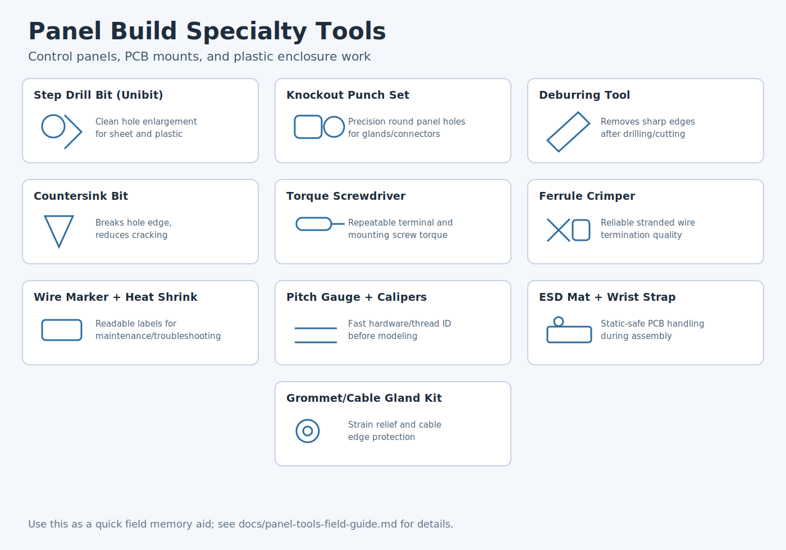

# Panel Build Tool Field Guide (Control Panels + Plastics + PCBs)

This section covers high-value tools that are not always obvious early on.

## Tool Quick Reference

| Tool | Primary Purpose | Use It When | Watch Out For |
|---|---|---|---|
| Step drill bit (Unibit) | Enlarge holes cleanly in sheet/plastic | Switches, glands, panel hole sizing | Run too fast and plastic can melt or grab |
| Knockout punch set | Make precise round panel holes | Clean holes in enclosure walls | Needs correct pilot and draw stud setup |
| Deburring tool / hand reamer | Remove burrs and sharp edges | After drilling/cutting holes | Skipping deburr can damage wires/grommets |
| Countersink/chamfer bit | Break edge/chamfer hole mouth | Prevent stress cracking in plastics | Too much chamfer weakens thin walls |
| Torque screwdriver (in-lb) | Apply repeatable screw torque | Terminals, PCB mounts, plastic bosses | Overtorque strips threads and cracks bosses |
| Ferrule crimper (square/hex) | Crimp ferrules on stranded wire | Any screw-terminal wiring work | Wrong die size causes loose/high-resistance joints |
| Wire marker printer + heat-shrink | Durable wire/cable identification | Panels needing serviceability | Inconsistent labels slow troubleshooting |
| Thread pitch gauge + calipers | Identify unknown screws/threads | Reverse engineering, replacement hardware | Mixing inch/metric because diameters are close |
| ESD mat + wrist strap | Protect electronics from static | Handling exposed PCBs | Poor grounding makes protection ineffective |
| Grommet/cable gland kit | Strain relief and edge protection | Cable entry through enclosure walls | Wrong gland range causes leaks/pull-out |

## Visual Guide

## Practical Sequence in Real Jobs

1. Mark center and pilot holes.
2. Open hole with step bit or knockout punch.
3. Deburr and light chamfer.
4. Install grommet/gland.
5. Route wire and terminate with ferrules.
6. Label wires and torque-check terminals.
7. Final ESD-safe board install and fastening.

## Fast Skill-Up Priorities

- Learn step bit sizing and feed/speed first.
- Learn ferrule crimp quality checks second.
- Learn torque-driver settings for your common screws.
- Learn quick thread ID with pitch gauge + calipers.
